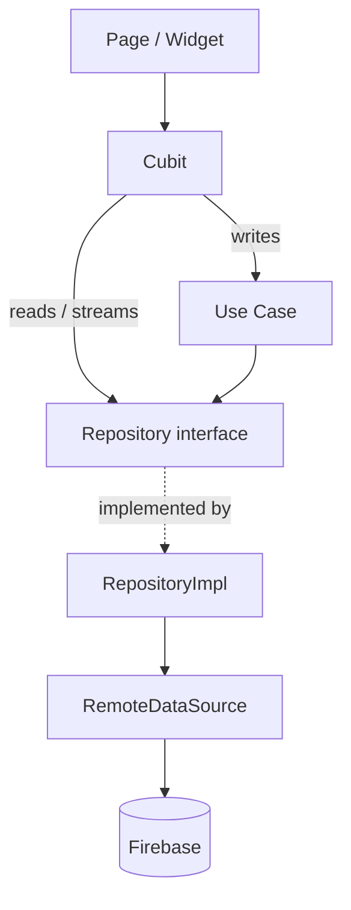
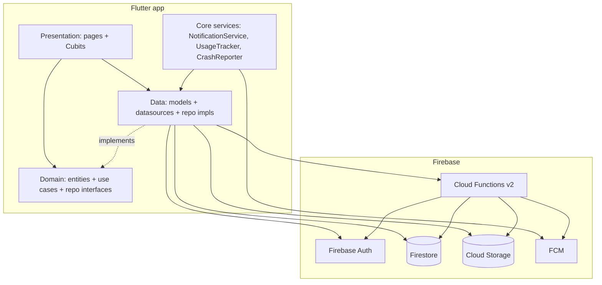
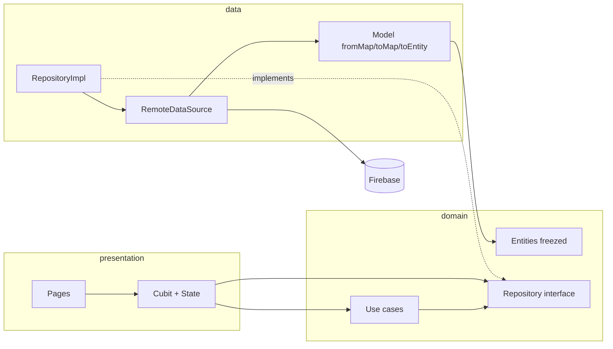
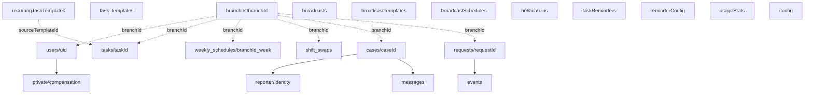
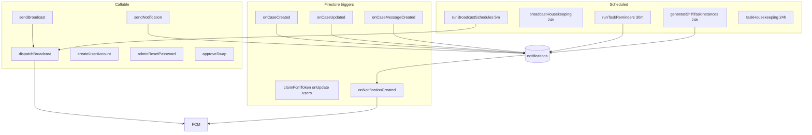
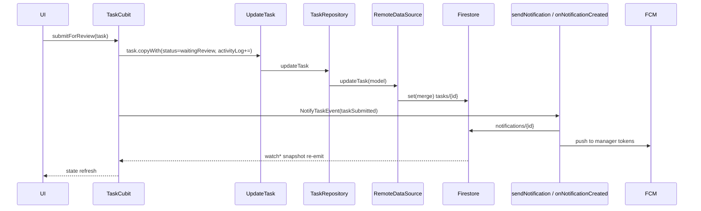

# DROP — Technical Architecture Documentation

> Reconstructed from source (no prior architecture doc assumed). Package id: `drop`.
> Repo folder + Firebase bundle id: `fbro`. Firebase project id: `bazic-d9ad7`.
> Product: **DROP — Operations Management System** (role-based branch/shift operations app).
>
> Anything not verifiable from source is explicitly marked **Unknown**.
> This document describes the system as it exists; it does not review, score, or recommend.

---

## Table of contents

1. [Project architecture](#1-project-architecture)
2. [Firestore schema](#2-firestore-schema)
3. [Data flow](#3-data-flow)
4. [Storage structure](#4-storage-structure)
5. [Cloud Functions](#5-cloud-functions)
6. [Security](#6-security)
7. [Repositories](#7-repositories)
8. [App startup](#8-app-startup)
9. [Offline](#9-offline)
10. [Data lifecycle](#10-data-lifecycle)
11. [Dependency graph](#11-dependency-graph)
12. [System diagrams](#12-system-diagrams)

---

## 1. PROJECT ARCHITECTURE

### 1.1 Overall architecture

Flutter client + Firebase backend (serverless). The client is **Clean Architecture** organized by **feature**, with three layers per feature: `data` → `domain` → `presentation`. State is managed with **Cubits** (`flutter_bloc`). Navigation uses **`go_router`**. Dependency injection is a hand-rolled static service locator (`AppDependencies`), not `get_it`.

Backend is **Firebase**: Firestore (primary datastore), Cloud Storage (media), Cloud Functions (2nd-gen, Node.js), Firebase Auth (identity), Firebase Cloud Messaging (push). There is no custom server.

```
Flutter app (Clean Architecture, feature-first)
    presentation  (pages + Cubits + widgets)
        │  depends on ↓
    domain        (entities, repository interfaces, use cases)  ← pure Dart, no Firebase
        ▲  implemented by ↓
    data          (models, remote datasources, repository impls)  ← Firebase lives here
        │
        ▼
Firebase (Firestore · Storage · Cloud Functions · Auth · FCM)
```

**Key invariant:** Firebase SDK imports (`cloud_firestore`, `firebase_storage`, `firebase_auth`, `firebase_messaging`, `cloud_functions`) appear **only** in the `data/` layer plus five core files:
`lib/core/di/injection.dart`, `lib/core/extensions/firestore_extensions.dart`, `lib/core/services/notification_service.dart`, `lib/core/services/usage_tracker.dart`, `lib/main.dart`.
`domain/` and `presentation/` never import Firebase.

### 1.2 Feature structure

Features live under `lib/features/<feature>/`. Each follows:

```
features/<feature>/
    data/
        datasources/     <feature>_remote_datasource.dart   (Firebase calls)
        models/          <feature>_model.dart                (Firestore (de)serialization + toEntity/fromEntity)
        repositories/    <feature>_repository_impl.dart      (implements the domain interface)
    domain/
        entities/        <feature>_entity.dart               (freezed immutable data classes)
        repositories/    <feature>_repository.dart           (abstract interface)
        usecases/        <verb>_<noun>.dart                  (single-purpose callable classes)
    presentation/
        cubit/           <feature>_cubit.dart + <feature>_state.dart
        pages/           screens
        widgets/         feature-scoped widgets
```

Feature list (`lib/features/`):
`admin`, `auth`, `branch`, `cases`, `communications`, `employee`, `manager`, `notifications`, `operations`, `profile`, `requests`, `schedule`, `settings`, `statistics`, `task`.

(`employee` / `manager` are the role "shell" home screens; `operations` is the manager Branch-Operations cockpit; `settings` has no data layer of its own.)

Total Dart files: ~414.

### 1.3 Layer separation

| Layer | Contains | Knows about |
|---|---|---|
| **presentation** | Pages, Cubits, widgets | domain (entities, use cases, repo interfaces) |
| **domain** | Entities (freezed), repository **interfaces**, use cases | nothing outside pure Dart |
| **data** | Models, remote datasources, repository **impls** | domain + Firebase SDKs |

- **Models ↔ Entities:** every `data/models/*.dart` has `fromMap`/`toMap` (Firestore) and `toEntity`/`fromEntity` (domain boundary). Firestore `Timestamp` ⇄ `DateTime` conversion happens in the model.
- Entities are generated with **freezed** (`*.freezed.dart` present for each entity).
- Enums live in `lib/core/enums/` and each exposes a `.value` (the persisted string) + `fromString(...)`.

### 1.4 Dependency flow

```
Page ──uses──▶ Cubit ──calls──▶ UseCase ──calls──▶ RepositoryInterface
                 │                                        ▲
                 └────── (streams/read paths) ────────────┘   implemented by
                                                          RepositoryImpl ──▶ RemoteDataSource ──▶ Firebase
```

Two write/read conventions coexist deliberately (documented in DI as "hybrid cubits"):
- **Writes** go through **use cases** (`CreateTask`, `SendBroadcast`, `SendCaseMessage`, …).
- **Reads / realtime streams** are often called on the **repository directly** from the Cubit (e.g. `taskCubit` subscribes to `taskRepository.watch*`, `caseListCubit` reads role-scoped streams).

### 1.5 DI graph

`lib/core/di/injection.dart` → `AppDependencies` (all `static late final`, initialized once in `AppDependencies.init()`), so **every Cubit and repository is an app-wide singleton** for the process lifetime.

Firebase singletons injected at the leaves: `FirebaseAuth.instance`, `FirebaseFirestore.instance`, `FirebaseStorage.instance`, `FirebaseFunctions.instance`, `FirebaseMessaging.instance`.

Construction order (relevant couplings):
1. Datasources (auth, user, profile, task) → repositories.
2. `branchRepository` built early (TaskCubit needs it for the branch dropdown; reused by admin, cases, broadcasts, operations).
3. `notificationRepository` built early (TaskCubit needs `NotifyTaskEvent`).
4. `scheduleRepository` built early (TaskCubit needs it to resolve an employee's shift today + shift-task notification recipients; reused by schedule/swap/operations cubits).
5. Cubits assembled with their use cases.

Two cubits are **built on demand** (one per opened entity), not singletons:
- `createCaseConversationCubit(caseId, user)` → `CaseConversationCubit`
- `createRequestDetailCubit(requestId, user)` → `RequestDetailCubit`

Singleton cubits provided app-wide via `MultiBlocProvider` in `main.dart`:
`authCubit, profileCubit, taskCubit, branchCubit, adminUsersCubit, statisticsCubit, scheduleCubit, shiftSwapCubit, branchOperationsCubit, broadcastCubit, broadcastTemplateCubit, broadcastScheduleCubit, notificationCubit, caseListCubit, requestsListCubit`.

`notificationService` (FCM) and `UsageTracker` (telemetry) are plain services, not cubits.

### 1.6 Repository structure

26 repository files = 13 abstract interfaces (`domain/repositories/`) + 13 impls (`data/repositories/`). See §7 for each. One feature (communications) has three repositories (broadcast, broadcast template, broadcast schedule).

### 1.7 Data source structure

14 remote datasources, all `*RemoteDataSource` (abstract) + `*RemoteDataSourceImpl`. **There is no local datasource layer** — the "cache" is Firestore's built-in offline persistence (§9) plus one in-memory TTL cache inside `TaskRepositoryImpl` for templates. Datasources hold the Firebase SDK handles and expose `Future`/`Stream` of **models**.

### 1.8 Service layer

`lib/core/services/` and `lib/core/`:
- **`NotificationService`** — FCM engine: permission, token lifecycle (`users/{uid}.fcmTokens` array), foreground/tap routing. Uses `FirebaseMessaging` + `FirebaseFirestore`.
- **`UsageTracker`** — debounced telemetry increments to `usageStats/feed`.
- **`CaseSeenStore`** — local unread-dot tracking for cases (Unknown storage backend; likely in-memory/local).
- **`CrashReporter` / `AppLog` / `CrashContext`** (`lib/core/observability/`, `lib/core/utils/`) — crash funnels + structured logging.
- **`firestore_extensions.dart`** — `.date(key)` helper (`Timestamp?` → `DateTime?`), used by every model.

### 1.9 Cubits / state management

`flutter_bloc` Cubits. State classes are freezed unions (`*_state.dart`). A global `AppBlocObserver` logs lifecycle in debug builds. Cubits that hold Firestore stream subscriptions (they cancel on `close`/re-subscribe):
`auth, case_conversation, case_list, broadcast, notification, branch_operations, request_detail, requests_list, shift_swap, task`.

### 1.10 Navigation flow

`go_router` (`lib/core/routes/app_router.dart`), single `GoRouter` created once. Structure:

- **Outside the shell** (no sidebar): `splash`, `login`, `forgotPassword`, `forcePasswordChange`, `profileCompletion`, `welcome`.
- **`ShellRoute`** (`AppShell` persistent desktop sidebar) wraps everything else: role homes, tasks, schedule, admin module, communications, notifications, cases, requests, profile, settings.

**Redirect gate** (`_redirect`, pure/synchronous — never awaits):
1. First-login funnel (`firstLoginLocation`, ordered): `mustChangePassword` → `/force-password-change`; then `!isProfileCompleted` → `/profile-completion`; then employees with `!hasCompletedOnboarding` → `/welcome`.
2. Role guards: `_isAdminArea` (admin-only), `_isManagerArea` (manager + admin), `_isCommunicationsArea` (admin + manager). Employee home `/` is employee-only.
3. Fully-onboarded users are bounced off auth/onboarding screens to their role home.
4. Only an **explicitly** `unauthenticated` state routes to `/login` (transient states don't redirect).

`refreshListenable` = `_AuthStateNotifier` wrapping `authCubit.stream`, so navigation re-evaluates on every auth state change.
`RouteNames.homeForRole(role)` maps role → `/` (employee), `/manager`, `/admin`.

---

## 2. FIRESTORE SCHEMA

Collection names are centralized in `lib/core/constants/app_constants.dart`. Legend: `T` = Firestore `Timestamp`, `srv` = written as `serverTimestamp()`.

### 2.1 Collection tree

```
users/                                   ← identity + profile + role/branch (admin-provisioned)
    {uid}
        private/
            compensation                 ← salary + paymentNumber (owner + admin only)

branches/
    {branchId}                           ← branch record (+ optional swapPolicy)

tasks/
    {taskId}                             ← task record (embedded checklist, activityLog, attachments)

task_templates/
    {templateId}                         ← reusable task blueprint (branch-owned or global '')

recurringTaskTemplates/
    {templateId}                         ← recurring shift-task blueprint (branch-scoped)

weekly_schedules/
    {branchId}_{yyyy-MM-dd}              ← one doc per (branch, week); assignments/leave/notes maps

shift_swaps/
    {swapId}                             ← swap request between two employees

broadcasts/
    {broadcastId}                        ← announcement (function-written)

broadcastTemplates/
    {templateId}                         ← reusable broadcast blueprint

broadcastSchedules/
    {scheduleId}                         ← scheduled/recurring broadcast

notifications/
    {notificationId}                     ← one in-app notification per recipient

cases/
    {caseId}                             ← private conversation record (no creator uid on doc)
        reporter/
            identity                     ← private creator uid/name (owner + admin only)
        messages/
            {messageId}                  ← conversation messages (immutable)

requests/
    {requestId}                          ← operations request (dynamic `details` map)
        events/
            {eventId}                    ← request timeline (comments / attachment-added)

taskReminders/
    {taskId}                             ← per-task reminder ledger (function-written)

reminderConfig/
    {id}   (e.g. "global")               ← org-wide reminder rules

usageStats/
    {doc}  (e.g. "feed")                 ← aggregate FieldValue.increment counters

config/
    {doc}  (e.g. "taskRetention")        ← function-only config (no client access path)

counters/          ← DECLARED in constants (countersCollection). Not referenced by any datasource read. Unknown purpose (likely refCode sequence for requests). No Firestore rule block.
savedAudiences/    ← DECLARED in constants (savedAudiencesCollection). Unknown usage. No Firestore rule block.
```

### 2.2 `users/{uid}`

The user doc carries **both** the auth/role fields (`UserModel`) **and** the profile fields (`ProfileModel`) — one document, two mappers. Seeded server-side by `createUserAccount`.

| Field | Type | Notes |
|---|---|---|
| `uid` | string | == doc id |
| `email` | string | lower-cased |
| `displayName` | string? | canonical name; `fullName` is the legacy-synced mirror |
| `fullName` | string? | profile name (kept in sync with displayName) |
| `photoUrl` / `profileImage` | string? | avatar URL (kept in sync) |
| `coverImage` | string? | cover URL |
| `phoneNumber` | string? | |
| `address` | string? | onboarding/profile field |
| `emergencyContact` | string? | onboarding/profile field |
| `username`, `bio`, `gender`, `country`, `city`, `website` | string? | profile fields |
| `birthDate` | T? | |
| `authProvider` | string | e.g. `admin-created`, `unknown` |
| `isEmailVerified` | bool | |
| `role` | string | `admin` \| `manager` \| `employee` |
| `branchId` | string? | null/absent for a global admin |
| `isActive` | bool | deactivation flag (never hard-deleted) |
| `assignedShift` | string? | |
| `position` | string? | job title |
| `employmentStatus` | string | default `active` |
| `mustChangePassword` | bool | first-login gate |
| `isProfileCompleted` | bool | first-login gate |
| `hasCompletedOnboarding` | bool | one-time Welcome (employees) |
| `createdBy` | string? | provisioning admin uid |
| `fcmTokens` | array<string> | device push tokens (exclusive per device — see `claimFcmToken`) |
| `fcmToken` | string? | legacy single-token field (still read) |
| `fcmTokenUpdatedAt` | T? | |
| `createdAt` / `updatedAt` | T (srv) | |
| profile social counters | int | `followersCount`, `followingCount`, `postsCount`, `likesCount`, `isOnline`, `lastSeen`, `isProfilePublic`, `allowMessages`, `allowNotifications` — legacy social fields, read defensively (product is not a social network) |

**Compensation is deliberately absent from this doc.** It lives in:

`users/{uid}/private/compensation`
| Field | Type | Notes |
|---|---|---|
| `salaryAmount` | number | admin-set |
| `salaryType` | string | admin-set |
| `paymentMethod` | string | admin-set |
| `paymentNumber` | string | **owner-editable** (self-service salary-receiving number) |

**Ownership:** admin writes all privileged/provisioning fields; the owner may self-edit a limited profile subset + first-login flags + `fcmToken(s)` + `paymentNumber` (in the subdoc). Managers do not write user docs.

### 2.3 `branches/{branchId}` (`BranchModel`)

| Field | Type | Notes |
|---|---|---|
| `id` | string | |
| `name` | string | |
| `location` | string? | |
| `isActive` | bool | |
| `logoUrl` / `coverUrl` | string? | written by `setBranchImage`, not the edit form |
| `swapPolicy` | map? | `{ restrictToSamePosition: bool, minRestHours: number }` (null = permissive) |
| `deletedAt` | T? | **soft delete** (no hard delete) |
| `createdAt` / `updatedAt` | T (srv) | |

### 2.4 `tasks/{taskId}` (`TaskModel`)

| Field | Type | Notes |
|---|---|---|
| `id` | string | |
| `title` | string | |
| `description` | string? | |
| `type` | string | `daily` \| `special` |
| `status` | string | `pending` \| `started` \| `waitingReview` \| `approved` \| `rejected` (`completed` also defined) |
| `priority` | string | `low` \| `normal` \| `high` |
| `branchId` | string? | owning branch |
| `assigneeIds` | array<string> | canonical (Phase 9 multi-assignee) |
| `assignedEmployeeId` | string? | **denormalized mirror** of the primary assignee (rules/statistics rely on it) |
| `assignmentType` | string | `individual` \| `team` \| `shift` |
| `shift` | string? | `morning` \| `night` (for shift tasks) |
| `assignedShiftId` | string? | |
| `checklist` | array<map> | `{id, title, isRequired, completed, completedAt}` |
| `referenceAttachments` | array<map> | see attachment shape below |
| `activityLog` | array<map> | `{status, actorId, actorName, at:T, note, attachments[]}` — audit trail (client-stamped `at`) |
| `proofImageUrl` | string? | |
| `notes` | string? | |
| `deadline` | T? | |
| `createdBy` | string? | |
| `instanceDate` | T? | for generated recurring instances |
| `sourceTemplateId` | string? | recurring template origin |
| `recurrence` | map? | `{frequency, interval, weekday, hour, minute}` |
| `startedAt`, `submittedAt` | T? | lifecycle stamps |
| `approvedBy`, `approvedAt` | string?/T? | review |
| `rejectedBy`, `rejectedAt` | string?/T? | review |
| `reviewNotes`, `rejectionReason` | string? | |
| `revisionNumber` | int | rework counter |
| `requiresRework` | bool | |
| `archivedAt` | T? | **soft archive** (set by `taskHousekeeping`; clients filter it out of active lists) |
| `createdAt` / `updatedAt` | T (srv) | |

**Embedded attachment shape** (shared by tasks, cases, requests, activityLog):
`{ id, url, type ('image'|'video'), uploadedAt:T, uploadedBy, uploadedByName, durationMs }`.

Deterministic-id variant: a recurring shift-task instance is created at id `rt_{templateId}_{yyyy-MM-dd}` (UTC) by `generateShiftTaskInstances`.

### 2.5 `task_templates/{templateId}` & `recurringTaskTemplates/{templateId}`

- `task_templates`: reusable blueprint. `branchId` = owning branch, or `''` = **global** (admin). Fields include `title`, `checklistItems`, `usageCount`, timestamps. (Full field list per `TaskTemplateModel`.)
- `recurringTaskTemplates`: always branch-scoped. Fields: `title`, `description`, `priority`, `branchId`, `shift` (`morning`|`night`), `repeat` (`daily`|`weekly`|`once`), `weekday` (1=Mon..7=Sun, for weekly), `checklistItems[] {id,title,isRequired}`, `active` (bool), `createdBy`, timestamps. Read by `generateShiftTaskInstances`.

### 2.6 `weekly_schedules/{branchId}_{yyyy-MM-dd}` (`WeeklyScheduleModel`)

Deterministic id = `<branchId>_<Sunday-of-week yyyy-MM-dd>`. One doc per (branch, week).

| Field | Type | Notes |
|---|---|---|
| `id` | string | |
| `branchId` | string | |
| `weekStart` | T | Sunday 00:00 (local) of the week |
| `assignments` | map | `{ <day>: { <shift>: [uid, …] } }` — day ∈ `sunday..saturday`, shift ∈ `morning`/`night` |
| `dayNotes` | map | `{ <day>: text }` (absent when empty) |
| `leave` | map | `{ <day>: { <uid>: <leaveValue> } }` — leaveValue ∈ `Leave`(annual) / `Sick` / `Off` / `Pending` |
| `shiftHours` | map | `{ <day>: { <shift>: { start, end } } }` — per-week hour overrides (end > 1440 = overnight) |
| `createdBy` | string? | |
| `createdAt` / `updatedAt` | T (srv) | |

Writes to `assignments`/`dayNotes`/`leave`/`shiftHours` use **targeted dotted-path field updates** with `arrayUnion`/`arrayRemove`/`FieldValue.delete()` — never a whole-doc rewrite.

### 2.7 `shift_swaps/{swapId}` (`ShiftSwapModel`)

| Field | Type | Notes |
|---|---|---|
| `id` | string | |
| `branchId` | string | |
| `weekStart` | T | week Sunday (absolute instant) |
| `day` | string | `sunday..saturday` |
| `shift` | string | `morning` \| `night` |
| `requesterId` / `requesterName` | string / string? | |
| `targetId` / `targetName` | string / string? | |
| `status` | string | `pending` → `employeeApproved` → `managerApproved`; or `rejected` / `cancelled` |
| `note` | string? | |
| `createdAt` / `updatedAt` | T (srv) | |

### 2.8 `broadcasts/{broadcastId}` (`BroadcastModel`, written by Cloud Function)

| Field | Type | Notes |
|---|---|---|
| `id`, `title`, `message` | string | |
| `senderId`, `senderName`, `senderRole` | string | |
| `audience` | string | `allBranches` \| `branch` \| `user` \| `custom` |
| `branchId` | string | `''`=all, a branch id, `__direct__` (DM), or `__custom__` (hand-picked) |
| `targetUserId` | string | recipient for a `user` DM (`''` otherwise) |
| `targetUserIds` | array<string> | recipients for a `custom` send |
| `category` | string | `announcement` \| `reminder` \| `emergency` (drives push + priority) |
| `recipientCount` / `deliveredCount` | int? | delivery stats (function-written) |
| `archivedAt` | T? | client may flip only this field |
| `createdAt` | T (srv) | |

`broadcastTemplates/{id}`: reusable blueprint (`title`, `message`, `category`, `branchId` or `''` global, `usageCount` via `FieldValue.increment`). `broadcastSchedules/{id}`: `senderId/Role/Name`, `audience`, `branchId`, `targetUserIds`, `roleFilter`, `title`, `message`, `category`, `recurrenceType` (`oneTime`/`daily`/`weekly`/`monthly`/`custom`), `interval`, `endDate`, `nextRunAt`, `lastRunAt`, `runCount`, `enabled`.

### 2.9 `notifications/{id}` (`NotificationModel`)

| Field | Type | Notes |
|---|---|---|
| `id` | string | |
| `recipientUid` | string | owner |
| `senderUid` | string? | server-stamped; `''`/`system` for privacy/system sends |
| `type` | string | enum name — task/broadcast/swap/case types (see §2.14) |
| `title`, `body` | string | length-capped server-side (120/500) |
| `payload` | map | e.g. `{taskId, route, caseId, broadcastId, revisionNumber, swapId, category}` |
| `readAt` | T? | mark-read flips this |
| `archivedAt` | T? | archive (housekeeping deletes archived > 60d) |
| `pinnedAt` | T? | |
| `createdAt` | T (srv) | |

Clients never **create** notifications directly (rule: `create: if false`); they go through the `sendNotification` callable or are function-written. Clients may update (mark read) and delete their own.

### 2.10 `cases/{caseId}` (`CaseModel`) + subcollections

Case doc **has no creator uid** (privacy split). Fields:

| Field | Type | Notes |
|---|---|---|
| `id`, `subject` | string | |
| `branchId` | string? | |
| `description` | string? | read by `onCaseCreated` to write the opening message |
| `category` | string | `operations` \| `sales` \| `inventory` \| `staff` \| `security` \| `personal` |
| `recipient` | string | `manager` \| `admin` \| `both` |
| `visibleToManager` | bool | **denormalized** from `recipient` (drives manager query + rule) |
| `privacy` | string | `normal` \| `confidential` |
| `reporterDisplayName` | string? | written **only** when privacy = normal |
| `urgent` | bool | |
| `status` | string | `open` \| `inDiscussion` \| `waitingResponse` \| `closed` |
| `attachments` | array<map> | opening attachments |
| `lastMessagePreview` | string? | inbox row (function-bumped) |
| `lastMessageAt` | T? | ordering (function-bumped) |
| `messageCount` | int | `FieldValue.increment` (function-bumped) |
| `closedAt` | T? | stamped on close, cleared on reopen |
| `createdAt` / `updatedAt` | T (srv) | |

`cases/{id}/reporter/identity` (private, owner+admin only): `{ caseId, createdByUserId, createdByName, privacy, branchId, createdAt }`.
Written **atomically with the case** in one `WriteBatch`.

`cases/{id}/messages/{messageId}` (immutable, no update/delete): `{ authorId, authorName, authorRole (reporter|manager|admin|system), kind (message|opening|system), text, attachments[], systemEvent, createdAt (== request.time) }`. `opening` + `system` kinds are Admin-SDK-only (clients can only write `message`).

### 2.11 `requests/{requestId}` (`RequestModel`) + `events` subcollection

Polymorphic operations request; the type-specific fields live in a dynamic `details` map.

| Field | Type | Notes |
|---|---|---|
| `id` | string | |
| `refCode` / `seq` | string? / int? | human-readable code + sequence — noted as server-managed (see §5 note on `onRequest*`); **Unknown** who assigns them (no assigner found in read source) |
| `branchId` | string? | |
| `type` | string | `employeeDiscount`, `leaveStore`, `giftApproval`, `stockRequest`, `maintenance`, `customerIssue`, `cashRequest`, `equipmentRequest`, `branchSupport`, `other` |
| `approvalPolicy` | string | e.g. `managerOrAdmin` |
| `status` | string | `pending` \| `approved` \| `completed` \| `rejected` \| `cancelled` |
| `priority` | string | `low` \| `normal` \| `high` |
| `requesterId` / `requesterName` / `requesterRole` | string | |
| `details` | map | dynamic form values (Timestamp⇄DateTime normalized at the model boundary) |
| `attachments` | array<map> | |
| `lastEventPreview` / `lastEventAt` / `eventCount` | string?/T?/int | inbox row + timeline bump |
| `decidedBy` / `decidedByName` / `decidedAt` | string?/string?/T? | on approve/reject |
| `completedAt` | T? | on complete |
| `createdAt` / `updatedAt` | T (srv) | |

`requests/{id}/events/{eventId}`: `{ authorId, authorName, actor, kind, text, attachments[], createdAt (srv) }`.

### 2.12 Config / ledger collections

- `taskReminders/{taskId}`: `{ taskId, lastKind (due24h|due1h|overdue), count, lastSentAt }` — anti-spam ledger (function-written only; admin-read).
- `reminderConfig/{id}` (e.g. `global`): `{ enabled, quietStartHour, quietEndHour, maxReminders }`.
- `usageStats/{doc}` (e.g. `feed`): aggregate `FieldValue.increment` counters (preset/sort/expansion/approve/note usage).
- `config/{doc}` (e.g. `taskRetention`): `{ archiveAfterDays, coldTierImages, deleteAfterDays }` — read by `taskHousekeeping`; **no client access path**.

### 2.13 Relationships

```
branches (1) ──< users            (users.branchId)
branches (1) ──< tasks            (tasks.branchId)
branches (1) ──< weekly_schedules (schedule.branchId; id = branchId_week)
branches (1) ──< shift_swaps      (swap.branchId)
branches (1) ──< cases            (case.branchId)
branches (1) ──< requests         (request.branchId)
branches (1) ──< recurringTaskTemplates

users (N) ──< tasks               (tasks.assigneeIds[] contains uid; mirror assignedEmployeeId)
users (2) ──  shift_swaps          (requesterId, targetId)
users (1) ──< notifications        (recipientUid)
users (1) ──1 users/{uid}/private/compensation

weekly_schedules.assignments[day][shift][] ── uids  (roster membership; also used to resolve shift-task recipients)

cases (1) ──1 cases/{id}/reporter/identity  (creator uid, private)
cases (1) ──< cases/{id}/messages
requests (1) ──< requests/{id}/events
recurringTaskTemplates (1) ──< tasks  (sourceTemplateId; instance id rt_{tpl}_{date})
broadcasts / notifications  ── cross-referenced by payload.broadcastId
```

There are **no Firestore `DocumentReference` fields** — all relationships are by **string id** (or embedded arrays/maps).

### 2.14 Notification `type` values

`taskAssigned, taskRework, taskSubmitted, taskApproved, taskRejected, taskReminder, taskOverdue, broadcastAnnouncement, broadcastReminder, broadcastEmergency, swapRequested, swapAccepted, swapApproved, swapRejected, caseOpened, caseUpdated, caseClosed` (persisted as the enum name; also `caseReplied` used server-side).

---

## 3. DATA FLOW

Notation: `↓` = calls into. Firestore listeners re-emit to the Cubit automatically (`⟳`).

### 3.1 Create Task
```
New Task sheet (page)
  ↓ TaskCubit.createTask(...)
  ↓ CreateTask use case  →  TaskRepository.createTask(entity)
  ↓ TaskRepositoryImpl → TaskRemoteDataSource.createTask(model)
  ↓ Firestore: tasks.doc() .set({...toMap(), createdAt/updatedAt: srv})
  ↓ (if reference attachments) uploadAttachment → Storage tasks/{id}/attachments/... → updateTask(referenceAttachments)
  ↓ TaskCubit → NotifyTaskEvent (taskAssigned) → sendNotification callable
        ↓ Cloud Function writes notifications/{id} per recipient
        ↓ onNotificationCreated trigger → FCM push
  ⟳ watchTasksByBranch / watchEmployeeTasks snapshot re-emits → Cubit → UI refresh
```

### 3.2 Task lifecycle (employee work → manager review)
```
Employee: startTask / toggleChecklistItem / addNote / submitForReview
  ↓ TaskCubit._updateTask(task.copyWith(status/activityLog/checklist...))
  ↓ UpdateTask → TaskRepository.updateTask → RemoteDataSource.updateTask
  ↓ Firestore: tasks.doc(id).set({...toMap(), updatedAt: srv}, merge:true)   (whole-doc merge)
  ↓ submitForReview also fires NotifyTaskEvent(taskSubmitted) → manager notification

Manager: approveTask / reworkTask / rejectTask
  ↓ TaskCubit._updateTask(status=approved|rejected|started, approvedBy/rejectedBy, activityLog+=event)
  ↓ same UpdateTask path
  ↓ NotifyTaskEvent(taskApproved|taskRejected|taskRework) → employee notification
  ⟳ realtime stream → both sides’ UI refresh

Reminders (server, no client): runTaskReminders (every 30 min) → notifications → onNotificationCreated → push
Archive (server): taskHousekeeping (daily) → tasks.archivedAt = now (approved > 30d); clients filter out
```

### 3.3 Shift swap
```
Employee A (requester): create swap
  ↓ ShiftSwapCubit → ScheduleRepository.createSwap → shift_swaps.doc().set(status='pending')
  ↓ NotifySwapEvent(swapRequested) → target coworker notification

Employee B (target): accept
  ↓ updateSwapStatus(status='employeeApproved')  (client write, field-locked by rules)
  ↓ NotifySwapEvent(swapAccepted) → manager/admin notification

Manager/Admin: approve
  ↓ ScheduleRemoteDataSource.approveSwap(swapId, scheduleId)
  ↓ callable approveSwap (Cloud Function, Admin SDK):
        re-validates (branch, future slot, rest hours, double-book) against freshest schedule
        runTransaction: swap.status='managerApproved' + swap assignments in weekly_schedules  (atomic)
  ↓ NotifySwapEvent(swapApproved) → both employees
  ⟳ watchEmployeeSwaps / watchBranchSwaps + weekly_schedules snapshots → UI refresh
```

### 3.4 Broadcast (announcement)
```
Compose screen
  ↓ BroadcastCubit → SendBroadcast → BroadcastRepository → callable sendBroadcast
  ↓ Cloud Function dispatchBroadcast:
        validate sender permissions (role→audience)
        resolve recipients (all active users | branch | user | custom list)
        broadcasts.doc().set({...})                         (persist doc)
        batch write notifications/{id} per recipient (pushedByFunction:true)
        FCM sendEach per token (chunked 500) + prune dead tokens
        broadcast.deliveredCount = N
  ⟳ broadcasts feed snapshot → UI; recipients’ notifications snapshot → UI + FCM push (via sendBroadcast, not onNotificationCreated)

Scheduled variant: runBroadcastSchedules (every 5 min) → same dispatchBroadcast + advance nextRunAt
```

### 3.5 Case (private conversation)
```
Create Case screen
  ↓ CaseListCubit → CreateCase → CaseRepository.createCase(case, identity)
  ↓ WriteBatch: cases.doc().set({...}) + cases/{id}/reporter/identity.set({...})   (atomic)
  ↓ onCaseCreated trigger (server):
        append opening message (de-identified if confidential)
        resolveCaseRecipients (branch managers / admins) → writeCaseNotifications → onNotificationCreated → push

Reply
  ↓ CaseConversationCubit → SendCaseMessage → cases/{id}/messages.add({..., createdAt: srv})
  ↓ onCaseMessageCreated: bump case lastMessage*/messageCount + notify the OTHER party

Status change (manager/admin)
  ↓ ChangeCaseStatus → cases.doc().update({status, closedAt})
  ↓ onCaseUpdated: append system message + notify reporter (or recipients on reopen)
  ⟳ watchCase + watchMessages snapshots → UI
```

### 3.6 Request (operations approval)
```
Create Request screen (dynamic form by RequestType)
  ↓ RequestsListCubit → CreateRequest → RequestRepository.createRequest
  ↓ (opening media uploaded to requests/{preId}/attachments first, via newRequestId)
  ↓ requests.doc(id).set({...toMap(), createdAt/updatedAt/lastEventAt: srv})
  ↓ NOTE: comments in source reference server-side onRequest* functions for notifications;
          those functions are NOT present in functions/index.js (as read). See §5.

Comment / attachment: addEvent → requests/{id}/events.add({..., createdAt: srv}) (single add, no array rewrite)
Decision: changeStatus(to, decidedBy) → requests.doc().update({status, decided*, completedAt})
  ⟳ watchAllRequests / watchBranchRequests / watchMyRequests + watchEvents snapshots → UI
```

### 3.7 Notification delivery (two push paths)
```
Path A (task/swap/case, client- or trigger-originated):
    notifications/{id} created  →  onNotificationCreated trigger  →  read recipient fcmTokens  →  FCM push  →  prune dead tokens

Path B (broadcast):
    sendBroadcast function pushes FCM itself and marks notifications pushedByFunction:true
    → onNotificationCreated sees the flag and SKIPS (no double push)

Client receive (NotificationService):
    onMessage (foreground) → in-app snackbar (if recipientUid matches signed-in uid)
    onMessageOpenedApp / getInitialMessage (tap) → router.push(task_details) or go(notifications)
    mismatched recipientUid → dropped + self-heal re-register (token drift guard)
```

### 3.8 Account creation (admin)
```
Create Account screen (admin)
  ↓ AdminUsersCubit → UserAdminRepository → callable createUserAccount (Admin SDK)
  ↓ auth.createUser(email,password)  (does NOT sign the admin out)
  ↓ users/{uid}.set({role, branchId, mustChangePassword:true, isProfileCompleted:false, ...})
  ↓ (on Firestore failure: auth.deleteUser rollback)
```

---

## 4. STORAGE STRUCTURE

Bucket: the default Firebase Storage bucket for project `bazic-d9ad7`.

```
users/{uid}/
    avatar.jpg        ← profile image  (fixed path → overwrite on change)
    cover.jpg         ← cover image    (fixed path → overwrite on change)

tasks/{taskId}/attachments/
    {pushId}.{ext}    ← proof / reference media (image|video); UNIQUE id per upload → never overwritten (immutable)

cases/{caseId}/attachments/
    {pushId}.{ext}    ← case media; unique id → immutable

requests/{requestId}/attachments/
    {pushId}.{ext}    ← request media; unique id → immutable

branches/{branchId}/
    logo.jpg / cover.jpg   ← branch media (fixed path → overwrite)
```

**File naming:**
- Profile & branch media: **fixed filenames** (`avatar.jpg`, `cover.jpg`, `logo.jpg`) → new upload overwrites; Firebase issues a fresh download token so the saved URL changes.
- Task/case/request media: filename is a **fresh Firestore push id** (`_collection.doc().id`, 20-char) + extension derived from the source path (fallback `jpg`/`mp4`). Content-Type set from extension.

**Uploads:** `putFile` with `SettableMetadata(contentType)`, byte-progress via `snapshotEvents`, a hard timeout (60s profile / 180s task/case/request) that cancels the task, and a translated error message (distinguishing permission/bucket errors from network errors). Download URL fetched with a 20–30s timeout.

**Cleanup / ownership:**
- Task media re-tiered to COLDLINE by `taskHousekeeping` when a task is archived (if `coldTierImages`); hard-deleted (Storage prefix first, then doc) only when the opt-in `deleteAfterDays` purge runs.
- `deleteTask` (client) removes the Firestore doc only. `deleteRequest` (client) removes the request doc only and **leaves the `events` subcollection in place** (documented as intentionally orphaned; rare admin op).
- Profile/branch media are overwritten in place (no per-version accumulation).
- Ownership at the Storage layer: any signed-in user may read; the owner writes their own `users/{uid}/…`; task/case/request/branch media are create-only or write-by-any-signed-in-user with the meaningful gate being the Firestore write of the URL (see §6).

---

## 5. CLOUD FUNCTIONS

All in `functions/index.js` (Node.js, `firebase-functions` v6, **2nd-gen** API). `admin.initializeApp()`; handles: `db`, `messaging`, `auth`. Default region (**Unknown** / not pinned → `us-central1`).

Collection name constants mirror the client. Shared helper `dispatchBroadcast(params)` powers both the callable and the scheduled broadcast.

| Function | Type / Trigger | Purpose | Reads | Writes | Collections touched | Dependencies |
|---|---|---|---|---|---|---|
| **sendBroadcast** | `onCall` | Validate sender, resolve recipients, persist broadcast, fan-out inbox + FCM | `users/{caller}`, users by audience | `broadcasts/{id}`, `notifications/*`, users `fcmTokens` (prune) | users, broadcasts, notifications | `dispatchBroadcast`, messaging |
| **createUserAccount** | `onCall` (admin only) | Provision Auth user + seed user doc | `users/{caller}` | Auth user, `users/{uid}` | users, Auth | `auth.createUser` |
| **adminResetPassword** | `onCall` (admin only) | Set temp password + force change | `users/{caller}` | Auth password, `users/{uid}` (merge) | users, Auth | `auth.updateUser` |
| **approveSwap** | `onCall` | Re-validate + atomically exchange a coworker-approved swap | `shift_swaps/{id}`, `users/{caller,req,tgt}`, `branches/{id}`, `weekly_schedules/{id}` | `shift_swaps/{id}.status`, `weekly_schedules.assignments` | shift_swaps, users, branches, weekly_schedules | `runTransaction` |
| **claimFcmToken** | `onDocumentUpdated users/{uid}` | Enforce EXCLUSIVE token ownership (remove a newly-added token from all other users) | users where `fcmTokens array-contains` / `fcmToken ==` | other users `fcmTokens`/`fcmToken` (remove) | users | — (loop-safe) |
| **sendNotification** | `onCall` | The ONLY client path to create notifications (type whitelist, branch-reach check, server-stamped senderUid) | `users/{caller}`, `users/{recipient}` | `notifications/*` (batch) | users, notifications | — |
| **onNotificationCreated** | `onDocumentCreated notifications/{id}` | Deliver FCM push for a new notification (skips `pushedByFunction`) | `users/{recipient}` | user `fcmTokens` (prune) | users, notifications | messaging |
| **runBroadcastSchedules** | `onSchedule every 5 min` | Fire due enabled schedules, advance `nextRunAt` | `broadcastSchedules` where `nextRunAt <= now`, `users/{sender}` | via `dispatchBroadcast`; `broadcastSchedules/{id}` | broadcastSchedules, users, broadcasts, notifications | `dispatchBroadcast`, `computeScheduleNextRun` |
| **broadcastHousekeeping** | `onSchedule every 24h` | Delete archived notifications > 60d | `notifications` where `archivedAt <= cutoff` | delete `notifications/*` | notifications | — |
| **runTaskReminders** | `onSchedule every 30 min` | Escalating task reminders (due24h→due1h→overdue) with per-task ledger + quiet hours (UTC) + cap | `tasks` where `deadline <= now+24h`, `reminderConfig/global`, `taskReminders/{taskId}` | `notifications/*`, `taskReminders/{taskId}` | tasks, reminderConfig, taskReminders, notifications | — |
| **generateShiftTaskInstances** | `onSchedule every 24h` | Materialize one `tasks/{rt_tpl_date}` per due recurring template; notify rostered employees | `recurringTaskTemplates` where `active`, `weekly_schedules/{id}` | `tasks/{deterministicId}`, `notifications/*` | recurringTaskTemplates, tasks, weekly_schedules, notifications | deterministic id = dup guard |
| **taskHousekeeping** | `onSchedule every 24h` | Archive approved tasks > `archiveAfterDays` (soft), cold-tier Storage, opt-in hard delete | `tasks` (paged by `approvedAt`/`archivedAt`), `config/taskRetention`, Storage list | `tasks.archivedAt`, Storage class/delete, `tasks` delete | tasks, config, Storage | `admin.storage().bucket()` |
| **onCaseCreated** | `onDocumentCreated cases/{caseId}` | Write opening message (de-identified if confidential) + notify recipients | `cases/{id}/reporter/identity`, users (managers/admins) | `cases/{id}/messages/*`, case bumps, `notifications/*` | cases, users, notifications | `resolveCaseRecipients` |
| **onCaseUpdated** | `onDocumentUpdated cases/{caseId}` | On status change: append system message + notify affected party | identity, users | `cases/{id}/messages/*`, `notifications/*` | cases, users, notifications | status diff guard |
| **onCaseMessageCreated** | `onDocumentCreated cases/{id}/messages/{id}` | Bump parent case + notify the other party | case doc, identity, users | case `lastMessage*`/`messageCount`, `notifications/*` | cases, users, notifications | — |

**Note (factual):** the client (`injection.dart`, `request_remote_datasource.dart`) references **`onRequest*` Cloud Functions** for request notifications / `refCode` sequencing. No `onRequest*` (or requests-related) function exists in `functions/index.js` as read. Whether they are deployed from another source is **Unknown**.

Broadcast/notification push carries `data.recipientUid` per token (client-side drop guard). Dead-token pruning uses FCM error codes (`registration-token-not-registered`, `invalid-registration-token`, `invalid-argument`).

---

## 6. SECURITY

Two rule files: `firestore.rules` and `storage.rules`. Firebase Auth is the identity source; **all authorization is in rules** (no custom claims observed — role/branch are read from the caller's `users/{uid}` doc).

### 6.1 Firestore rules — building blocks

- `isSignedIn()` — `request.auth != null`.
- `isOwner(uid)` — `request.auth.uid == uid`.
- `selfDoc()` — `get(users/{auth.uid}).data` (Firestore caches this `get()` per request → billed once).
- `selfRole()` / `selfBranch()` — the caller's role/branch from `selfDoc()`.
- `isAdmin()` / `isManager()`.
- `canReachBranch(branch)` — **admin = any branch; manager = own branch only**. Employees never reach a whole branch.
- `isCaseReporter(caseId)` — reads the private `reporter/identity` subdoc to resolve owner-of-case (single-doc gets only).
- `caseData(caseId)` — parent case data for the `messages` subcollection rules.

### 6.2 Per-collection model (summary)

| Collection | Read | Create | Update | Delete |
|---|---|---|---|---|
| `users/{uid}` | owner, admin, or same-branch member | **false** (only `createUserAccount`) | admin (all) or owner (limited: profile + first-login flags + fcmToken; **privileged fields frozen**) | **false** (deactivate via `isActive`) |
| `users/{uid}/private/{doc}` | owner or admin | admin, or owner (`compensation`, `paymentNumber` only) | admin, or owner (`paymentNumber` diff only) | false |
| `tasks/{id}` | branch-reachable, assignee, or shift-task-in-my-branch | branch-reachable | branch-reachable (approved locked except admin reopen) OR assignee/shift-employee (fields locked: can't reassign/move branch/forge review/set terminal) | branch-reachable & not approved |
| `task_templates`, `broadcastTemplates`, `recurringTaskTemplates` | admin or manager | admin, or own-branch manager | admin, or owning-branch manager | same |
| `branches/{id}` | any signed-in | admin | admin | false (soft delete) |
| `weekly_schedules/{id}` | `resource==null` OR branch-reachable OR branch employee | branch-reachable | branch-reachable | branch-reachable |
| `shift_swaps/{id}` | branch-reachable, requester, or target | requester, own branch, future slot only | manager/admin (not `managerApproved`) OR involved employee (status+updatedAt only, per-party transitions) | branch-reachable |
| `broadcasts/{id}` | admin, targetUserId, in targetUserIds, or branch/all member | **false** (`sendBroadcast`) | only `archivedAt` diff, by admin/sender/branch-manager | admin/sender/branch-manager |
| `broadcastSchedules/{id}` | admin or creator | creator (manager own branch) | admin or creator | admin or creator |
| `notifications/{id}` | recipient or admin | **false** (`sendNotification`/functions) | recipient (mark read) | recipient or admin |
| `taskReminders/{id}` | admin | false | false | false |
| `reminderConfig/{id}` | admin or manager | — | admin | — |
| `cases/{id}` | admin, own-branch manager (`visibleToManager`), or reporter | admin, or branch member (own branch) | admin or own-branch manager (status) | admin |
| `cases/{id}/messages/{id}` | anyone who can read the case | participant, `kind=='message'`, case not closed, `createdAt==request.time`, author-stamped | false | false |
| `{path=**}/reporter/{doc}` (collection-group) | admin or `createdByUserId==uid` | signed-in, `identity` doc, self-claimed uid | false | false |
| `usageStats/{doc}` | admin | any signed-in (increment) | any signed-in | false |

**Collections with no rule block (as read):** `requests`, `counters`, `savedAudiences`, `config`. (`config` is written/read only by the Admin SDK, which bypasses rules; `requests`/`counters`/`savedAudiences` — **Unknown** whether rules are deployed elsewhere.)

### 6.3 Ownership & isolation model

- **Admin-provisioned identity:** no public registration. `createUserAccount` (Admin SDK) is the only user-doc creation path.
- **Branch isolation:** managers are confined to their own branch (`canReachBranch`); employees only reach their own data (their tasks, their swaps, their branch's schedule/roster, their notifications). Admin is global.
- **Privilege freeze:** the user-doc update rule enumerates privileged fields (`role`, `isActive`, `branchId`, `assignedShift`, `position`, `employmentStatus`, `createdBy`, `salaryAmount`, `salaryType`, `paymentMethod`) and requires them unchanged for a self-update.
- **Function-owned writes:** broadcasts, notifications, the swap finalization, opening/system case messages, and account creation are done by the Admin SDK (bypasses rules) — clients can't forge them.
- **Privacy split (cases):** the case doc has no creator uid; the identity lives in a subdoc readable only by owner + admin (a same-branch manager can't resolve a confidential reporter).

### 6.4 Storage rules

```
users/{uid}/{file}          read: signed-in;   write: owner only
tasks/{taskId}/{**}         read: signed-in;   create: signed-in;   update/delete: false (immutable)
cases/{caseId}/{**}         read: signed-in;   create: signed-in;   update/delete: false (immutable)
branches/{branchId}/{file}  read: signed-in;   write: signed-in
```
Storage rules can't read Firestore role cheaply, so branch/task/case writes are gated by the **Firestore write of the URL** onto the doc (which is role-checked). Task/case ids are unguessable 20-char auto-ids. (`requests/{**}` Storage path is used by the request datasource; a matching Storage rule block was **not** found in `storage.rules` — **Unknown** whether deployed elsewhere.)

---

## 7. REPOSITORIES

All repositories map **model → entity** at the boundary and translate `ServerException` → `ServerFailure`. Unless noted, caching = **none** (Firestore offline persistence is the cache).

| Repository | Responsibilities | Remote datasource | Models | Entities | Caching | Notable deps |
|---|---|---|---|---|---|---|
| **AuthRepository** | Sign-in/out, session restore, current-user watch, get users by branch, password reset/change | `AuthRemoteDataSource`, `UserRemoteDataSource` | `UserModel` | `UserEntity` | none | FirebaseAuth + Firestore |
| **ProfileRepository** | Load/update profile, avatar/cover upload, username availability, paymentNumber (private subdoc) | `ProfileRemoteDataSource`, `AuthRemoteDataSource` | `ProfileModel` | `ProfileEntity` | none | Storage |
| **TaskRepository** | Task CRUD, realtime task streams (all/branch/employee/shift), attachments, task templates, recurring templates; drops archived + sorts newest-first | `TaskRemoteDataSource` | `TaskModel`, `TaskTemplateModel`, `RecurringTaskTemplateModel` | `TaskEntity` (+ template entities) | **in-memory TTL (20 min) for task templates; invalidate-on-write** | Storage |
| **BranchRepository** | Branch CRUD (soft delete), branch media upload, directory (`loadIfNeeded`) | `BranchRemoteDataSource` | `BranchModel` | `BranchEntity` | directory kept in cubit | Storage |
| **UserAdminRepository** | Admin user administration; account create/reset via callables; edit contact/compensation | `UserAdminRemoteDataSource` | `UserModel`, `UserCompensation` | `UserEntity` | none | Cloud Functions |
| **StatisticsRepository** | Pass-through to compute admin/manager/employee stats | `StatisticsRemoteDataSource` | `StatisticsModel` | `StatisticsEntity` | none | — |
| **ScheduleRepository** | Weekly schedule read/write (targeted field ops), swaps CRUD + realtime, `approveSwap` callable | `ScheduleRemoteDataSource` | `WeeklyScheduleModel`, `ShiftSwapModel` | `WeeklyScheduleEntity`, `ShiftSwapEntity` | none | Cloud Functions |
| **BroadcastRepository** | Send broadcast (callable), realtime feed, archive/delete | `BroadcastRemoteDataSource` | `BroadcastModel` | `BroadcastEntity` | none | Cloud Functions |
| **BroadcastTemplateRepository** | Template CRUD + `usageCount` increment | `BroadcastTemplateRemoteDataSource` | `BroadcastTemplateModel` | `BroadcastTemplateEntity` | none | — |
| **BroadcastScheduleRepository** | Scheduled-broadcast CRUD | `BroadcastScheduleRemoteDataSource` | `BroadcastScheduleModel` | `BroadcastScheduleEntity` | none | — |
| **NotificationRepository** | Realtime inbox (limit/paged), mark read, archive/delete, `sendNotification` (task/swap events) | `NotificationRemoteDataSource` | `NotificationModel` | `NotificationEntity` | none | Cloud Functions |
| **CaseRepository** | Case create (batch: case + identity), realtime list/case/messages, send message, change status, upload attachment | `CaseRemoteDataSource` | `CaseModel` (+ identity/message) | `CaseEntity`, `CaseMessage`, `CaseIdentity` | none | Storage |
| **RequestRepository** | Request create (pre-id + media), realtime list/request/events, change status, add event, upload attachment, delete | `RequestRemoteDataSource` | `RequestModel` (+ event) | `RequestEntity`, `RequestEvent` | none | Storage |

`StatisticsRepositoryImpl` is a thin pass-through (~31 lines). Statistics are **computed, not stored** (server-side `count()` aggregation for admin; client-side counting from branch/employee task queries for manager/employee).

---

## 8. APP STARTUP

Entry: `lib/main.dart` → `main()` → `runZonedGuarded(_bootstrap, CrashReporter.recordZoneError)`.

```
1. runZonedGuarded → _bootstrap()
     WidgetsFlutterBinding.ensureInitialized()
     CrashReporter.install()                 (crash funnels: FlutterError.onError, PlatformDispatcher.onError, isolate, zone)
     Bloc.observer = AppBlocObserver()        (debug builds only)
     runApp(LaunchApp)                         ← paints a black frame immediately
     unawaited(_surfacePendingCrashReport())   (banner if last session crashed)

2. LaunchApp (StatefulWidget) — cold-start rendezvous
     initState → postFrameCallback → _startBootstrap()
     shows SplashPage until BOTH: splash animation done AND router ready

3. _initializeRuntime()
     Firebase.initializeApp(DefaultFirebaseOptions.currentPlatform)   (if not already)
     FirebaseFirestore.settings = { persistenceEnabled: true, cacheSizeBytes: UNLIMITED }   ← BEFORE first Firestore op
     AppDependencies.init()      (build all datasources/repos/cubits/services)
     UsageTracker.init(firestore)
     FirebaseMessaging.onBackgroundMessage(_firebaseMessagingBackgroundHandler)
     authCubit.restoreSession()   ← restores the Firebase Auth session, loads users/{uid}

4. If authenticated AND user.hasAppAccess:
     warm home-critical scopes in parallel:
        statisticsCubit.load(user)
        taskCubit.load(user)          (subscribes to realtime task streams for the role)
        branchCubit.loadIfNeeded()
     (schedule, swaps, cases, templates remain LAZY — loaded on first screen visit)

5. Build router:
     createRouter(authCubit, initialLocation = _initialLocationFor(state))
        _initialLocationFor: !isActive → /login; mustChangePassword → /force-password-change;
                             !isProfileCompleted → /profile-completion; else homeForRole(role)
     _configureNotificationService():
        notificationService.onForeground = in-app snackbar
        notificationService.onMessageTap = router.push(task_details) / go(notifications)
        notificationService.init()       (FCM permission + listeners; skipped on unsupported platforms)
     _handleAuthState(state):
        set CrashContext.userId/userRole
        notificationService.registerToken(uid)     (writes users/{uid}.fcmTokens; claimFcmToken reconciles)
        notificationCubit.load(uid)

6. LaunchApp mounts App(router) once _canEnterApp
     App = MultiBlocProvider(all singleton cubits) → BlocListener<AuthCubit> (re-runs _handleAuthState on auth change) → MaterialApp.router
```

Auth-state transitions are handled continuously: on `authenticated` → register token + load home scopes; on `unauthenticated` → `notificationService.forgetUser()` (removes this device's token) + `notificationCubit.clear()`. Sign-out also fires `onPreSignOut` (forget token **before** Firebase sign-out, while still authenticated).

Theme is dark-only (`AppTheme.dark`, monochrome design system).

---

## 9. OFFLINE

- **Persistence:** `FirebaseFirestore.settings = Settings(persistenceEnabled: true, cacheSizeBytes: CACHE_SIZE_UNLIMITED)`, set before the first Firestore operation. The local cache is unbounded.
- **Reads offline:** `get()`/`snapshots()` serve last-known data from the local cache when offline; snapshots re-emit with `fromCache` data and reconcile when connectivity returns.
- **Writes offline:** direct Firestore writes (task updates, schedule field ops, swap status, case messages, requests, notification mark-read) are **queued locally** by the SDK and flushed on reconnect.
- **Callable-dependent flows require connectivity:** `sendBroadcast`, `approveSwap`, `sendNotification`, `createUserAccount`, `adminResetPassword` are `httpsCallable` and do not queue offline (they need a live round-trip).
- **Statistics offline fallback:** `_aggCount` uses server-side `count()` online; when offline (`unavailable`), it falls back to counting the **same query's** documents from the local cache (`Source.cache`).
- **Synchronization:** Firestore's own last-write-wins reconciliation. Realtime cubits re-emit automatically as the cache reconciles.
- **Conflict handling:**
  - Field-level atomic ops used where concurrent writers are expected: schedule assignments (`arrayUnion`/`arrayRemove` on dotted paths), request events (`add`), case messages (`add`), `messageCount`/`usageStats` (`FieldValue.increment`), `fcmTokens` (`arrayUnion`/`arrayRemove`).
  - Task updates use whole-document `set(..., merge: true)` from an in-memory copy (last-write-wins at field granularity).
  - The one true transactional path is server-side: `approveSwap` (`runTransaction`, TOCTOU re-validation against the freshest schedule).
  - FCM token exclusivity is reconciled server-side by `claimFcmToken` even if the client cleanup didn't run.

---

## 10. DATA LIFECYCLE

### User
Create → `createUserAccount` (Auth user + `users/{uid}` seeded, `mustChangePassword:true`, `isProfileCompleted:false`).
First login → force password change → profile completion → (employees) one-time Welcome.
Update → admin edits privileged fields; owner edits limited profile + `paymentNumber` (private subdoc).
Deactivate → admin sets `isActive:false` (login blocked). **No hard delete** (rule denies; cleanup would be a function — none observed). Compensation lives/dies in `users/{uid}/private/compensation`.

### Task
Create → `tasks/{id}` (`pending`) by manager/admin, or generated (`generateShiftTaskInstances`, id `rt_tpl_date`).
Work → `started` → checklist/notes/proof → `waitingReview` (single whole-doc merge writes; `activityLog` appended in-memory).
Review → `approved` (locked; only admin reopen) or `rejected`/rework (`revisionNumber++`).
Reminders → `runTaskReminders` (escalating, ledgered).
Archive → `taskHousekeeping` sets `archivedAt` on approved tasks > 30d (**soft archive; doc stays in `tasks`**); clients filter archived out of active lists (deep-links + statistics still see it); Storage cold-tiered.
Delete → opt-in only (`config/taskRetention.deleteAfterDays`): Storage prefix deleted first, then doc. Manual `deleteTask` allowed for non-approved tasks (doc only).

### Notification
Create → `sendNotification` callable, or a server trigger/function (never a direct client create).
Deliver → `onNotificationCreated` FCM push (or pushed inline by `sendBroadcast` with `pushedByFunction:true`).
Read → recipient sets `readAt`. Archive → recipient sets `archivedAt`. Pin → `pinnedAt`.
Cleanup → `broadcastHousekeeping` deletes archived notifications > 60d. Recipient may delete anytime.

### Schedule (weekly_schedules)
Create → `createSchedule` (deterministic id `branchId_week`) by manager/admin; empty grid seeded.
Update → targeted field ops (`assignments`, `dayNotes`, `leave`, `shiftHours`) via `arrayUnion`/`arrayRemove`/`delete`; or `approveSwap` transaction.
Archive/Delete → **none observed** (docs persist; ~52/branch/year).

### Swap (shift_swaps)
Create → requester, `pending`, future slot only.
Accept → target → `employeeApproved` (notifies manager).
Finalize → `approveSwap` callable → `managerApproved` + schedule exchanged atomically.
Terminal → `rejected` (target/reviewer) or `cancelled` (requester). Delete → manager/admin. No auto-cleanup observed.

### Broadcast
Create → `sendBroadcast` (or `runBroadcastSchedules`) writes `broadcasts/{id}` + per-recipient notifications + FCM.
Archive → client flips `archivedAt` (admin/sender/branch-manager). Delete → admin/sender/branch-manager (whole doc). Broadcast docs themselves have no auto-cleanup (the 60-day housekeeping targets **notifications**, not broadcasts).

### Case
Create → `WriteBatch` writes `cases/{id}` + `reporter/identity`.
`onCaseCreated` → opening message + notify recipients.
Conversation → `messages` subcollection (`add`); each `onCaseMessageCreated` bumps the case + notifies the other party.
Status → `open` → `inDiscussion` → `waitingResponse` → `closed` (closed = read-only; reopen re-notifies). `onCaseUpdated` appends a system message.
Delete → admin only (doc; subcollections/Storage cleanup **not observed**).

### Request
Create → `requests/{id}` (`pending`); opening media pre-uploaded under a pre-generated id.
Timeline → `events` subcollection (`add`).
Decision → `changeStatus` → `approved`/`rejected` (`decided*`) → `completed` (`completedAt`); or `cancelled`.
Delete → `deleteRequest` (doc only; `events` intentionally left orphaned).
`refCode`/`seq` + notifications → noted as server-managed by `onRequest*`, which is **not present** in `functions/index.js` (as read). No `requests`/`counters` Firestore rule block was found. **Status of this feature's server side: Unknown / apparently in progress** (the `requests` feature files are untracked/new per git status).

---

## 11. DEPENDENCY GRAPH

Generic per-feature chain (holds for every feature):



Concrete graphs:

**Task**
```
TaskManagementScreen / MyTasksScreen / TaskDetail
  → TaskCubit
      → CreateTask/UpdateTask/DeleteTask/AssignTask/UploadTaskAttachment (use cases) → TaskRepository
      → NotifyTaskEvent → NotificationRepository → callable sendNotification
      → (reads) TaskRepository.watch* (direct)
      → BranchRepository (branch dropdown), ScheduleRepository (shift-of-today)
  → TaskRepositoryImpl → TaskRemoteDataSource → Firestore tasks/ + Storage tasks/
```

**Schedule / Swap**
```
Schedule screens → ScheduleCubit → ScheduleRepository → ScheduleRemoteDataSource → weekly_schedules/, Functions(approveSwap)
Swap screens     → ShiftSwapCubit → ScheduleRepository + NotifySwapEvent(NotificationRepository) → shift_swaps/
```

**Communications**
```
Communications screens → BroadcastCubit → SendBroadcast → BroadcastRepository → BroadcastRemoteDataSource → callable sendBroadcast; feed via broadcasts/
                       → BroadcastTemplateCubit → BroadcastTemplateRepository → broadcastTemplates/
                       → BroadcastScheduleCubit → BroadcastScheduleRepository → broadcastSchedules/
```

**Cases**
```
CasesScreen → CaseListCubit → CreateCase/UploadCaseAttachment(use cases)+CaseRepository(read) → cases/
CaseConversationScreen → CaseConversationCubit(per-case) → SendCaseMessage/ChangeCaseStatus → cases/{id}/messages
```

**Requests**
```
RequestsScreen → RequestsListCubit → CreateRequest/UploadRequestAttachment + RequestRepository(read) → requests/
RequestDetailScreen → RequestDetailCubit(per-request) → ChangeRequestStatus/AddRequestComment → requests/{id}/events
```

**Auth / Profile / Admin / Statistics / Notifications**
```
Login/Splash → AuthCubit → SignIn/SignOut/GetUser/ForgotPassword/ChangePassword → AuthRepository → Auth+users/
Profile → ProfileCubit → GetProfile/UpdateProfile/UploadProfileImage/UploadCoverImage/CheckUsername → ProfileRepository → users/ + Storage users/
Admin → AdminUsersCubit → UserAdminRepository → callables createUserAccount/adminResetPassword + users/
        BranchCubit → BranchRepository → branches/ + Storage branches/
Dashboards → StatisticsCubit → StatisticsRepository → StatisticsRemoteDataSource → users/tasks/branches/weekly_schedules (count() + reads)
Inbox → NotificationCubit → NotificationRepository → notifications/
FCM device side → NotificationService → FirebaseMessaging + users/{uid}.fcmTokens
```

---

## 12. SYSTEM DIAGRAMS

### 12.1 Overall architecture


### 12.2 Feature architecture (one feature = three layers)


### 12.3 Firestore schema (tree) — see §2.1 for the full ASCII tree.


### 12.4 Storage structure — see §4 (ASCII tree).
```
gs://<bucket>/
    users/{uid}/avatar.jpg, cover.jpg                 (owner-write, overwrite)
    tasks/{taskId}/attachments/{pushId}.{ext}          (create-only, immutable)
    cases/{caseId}/attachments/{pushId}.{ext}          (create-only, immutable)
    requests/{requestId}/attachments/{pushId}.{ext}    (create-only; rule block not found in storage.rules)
    branches/{branchId}/logo.jpg, cover.jpg            (signed-in write, overwrite)
```

### 12.5 Cloud Functions map


### 12.6 Data flow (task, end to end) — see §3.1/§3.2.


### 12.7 Dependency graph — see §11.

---

### Appendix A — Enum value reference (persisted `.value` strings)

- **UserRole:** `admin`, `manager`, `employee`
- **TaskStatus:** `pending`, `started`, `waitingReview`, `approved`, `rejected` (also `completed`)
- **TaskType:** `daily`, `special` · **TaskPriority:** `low`, `normal`, `high`
- **TaskAssignmentType:** `individual`, `team`, `shift`
- **ScheduleShift:** `morning`, `night` · **ScheduleDay:** `sunday`…`saturday` (Sunday-based, `value == name`)
- **SwapStatus:** `pending`, `employeeApproved`, `managerApproved`, `rejected`, `cancelled`
- **LeaveType** (persisted short value): `Leave` (annual), `Sick`, `Off` (dayOff), `Pending`
- **BroadcastAudience:** `allBranches`, `branch`, `user`, `custom`
- **Broadcast category:** `announcement`, `reminder`, `emergency`
- **NotificationType:** task/broadcast/swap/case types (`value == name`; see §2.14)
- **CaseStatus:** `open`, `inDiscussion`, `waitingResponse`, `closed`
- **CaseCategory:** `operations`, `sales`, `inventory`, `staff`, `security`, `personal`
- **CaseRecipient:** `manager`, `admin`, `both` · **CasePrivacy:** `normal`, `confidential`
- **RequestStatus:** `pending`, `approved`, `completed`, `rejected`, `cancelled`
- **RequestType:** `employeeDiscount`, `leaveStore`, `giftApproval`, `stockRequest`, `maintenance`, `customerIssue`, `cashRequest`, `equipmentRequest`, `branchSupport`, `other`
- **RequestPriority:** `low`, `normal`, `high`
- **AttachmentType:** `image`, `video`
- **RecurrenceFrequency:** `daily`, `weekly`, `monthly`

### Appendix B — Explicit "Unknown" list (not determinable from the source read)

1. `counters/` collection — declared in constants, not referenced by any datasource; purpose and writer Unknown.
2. `savedAudiences/` collection — declared, usage Unknown.
3. `onRequest*` Cloud Functions — referenced in client comments, absent from `functions/index.js`; deployment status Unknown.
4. Firestore rules for `requests` / `counters` / `savedAudiences`, and Storage rules for `requests/{**}` — not present in the read files; whether deployed elsewhere is Unknown.
5. `refCode` / `seq` assignment for requests — no assigner found in read source.
6. Cloud Functions **region** — not pinned in code; effective region Unknown (default assumed).
7. `CaseSeenStore` backing store — Unknown (in-memory vs persisted).
8. `AuthRemoteDataSource` / `restoreSession` internals were inferred from `main.dart` + DI, not read line-by-line.
